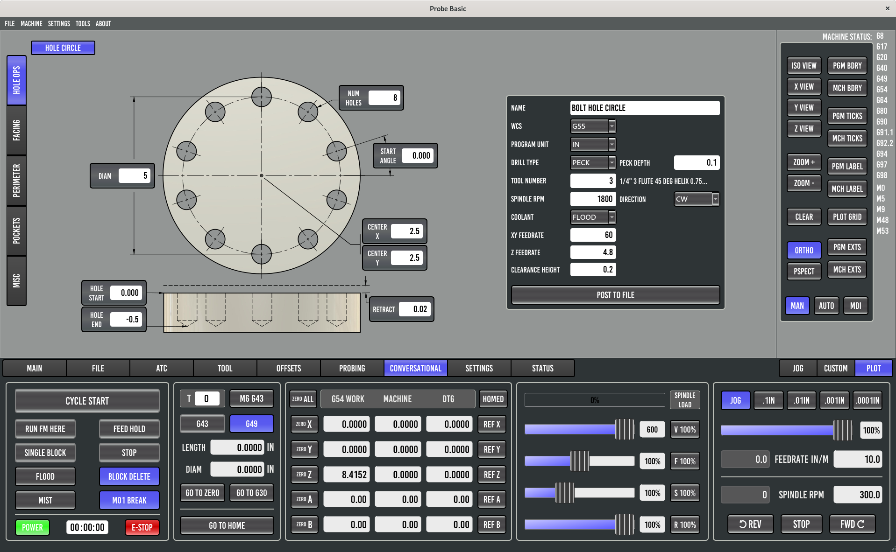
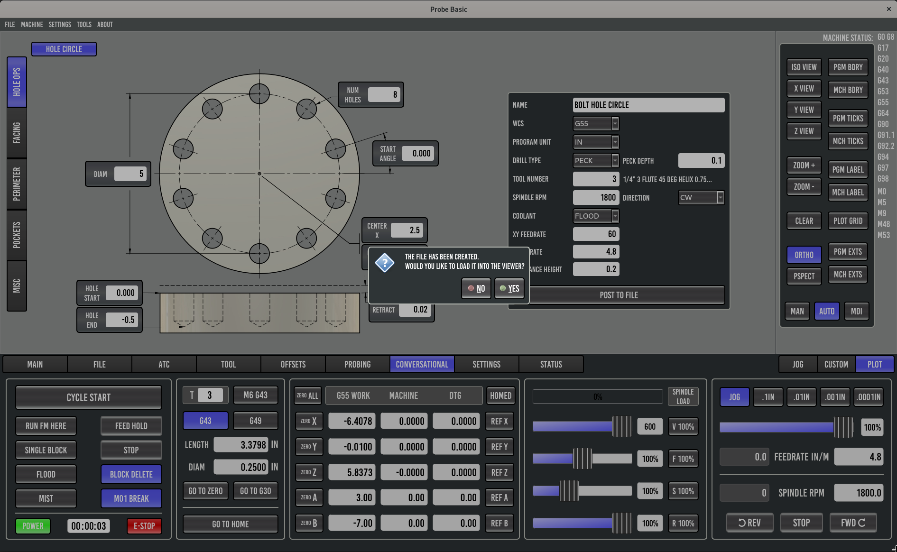
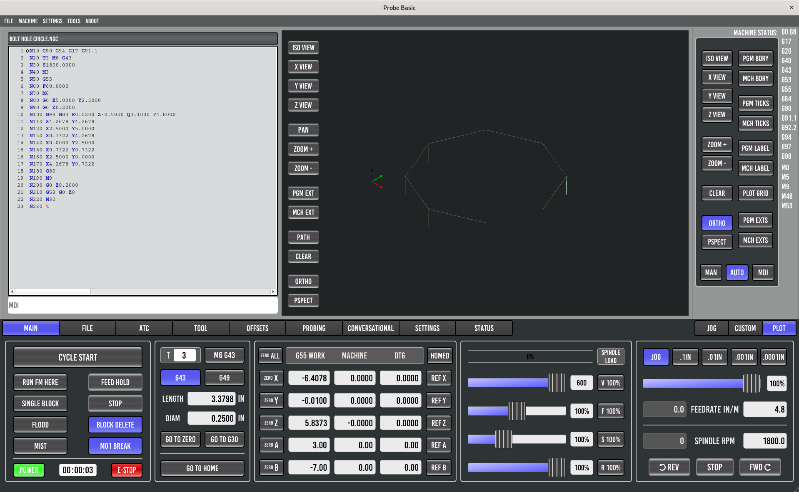
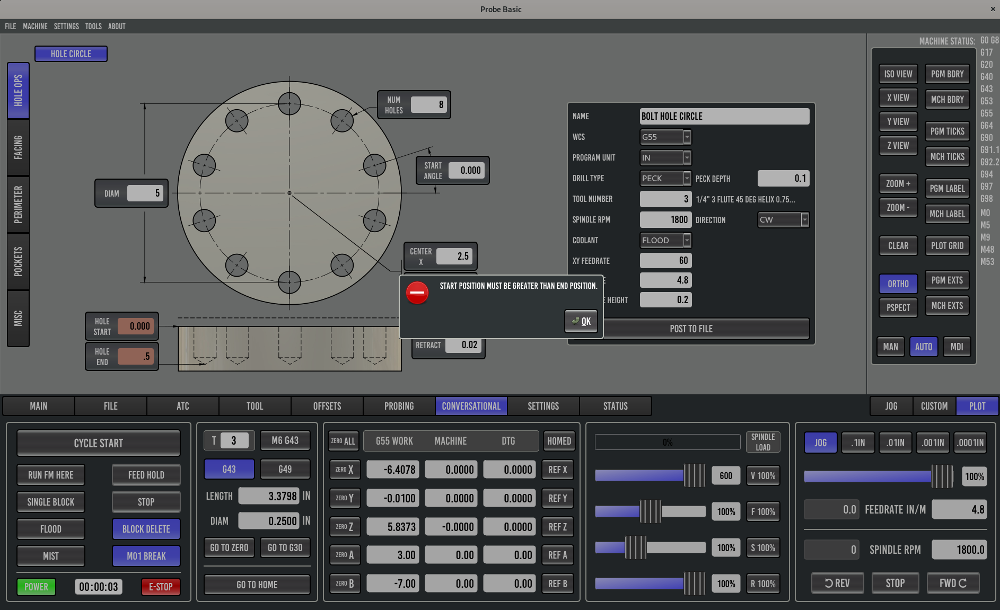

# QtPyVCP Conversational G-code Widgets

This repository contains conversational G-code generator widgets.

*Created by:* @adargel

## Install

`pip install git+https://github.com/kcjengr/qtpyvcp.conversational-gcode.git`

or clone or download the repo and run

`pip install .`

## Hole Circle Widget

